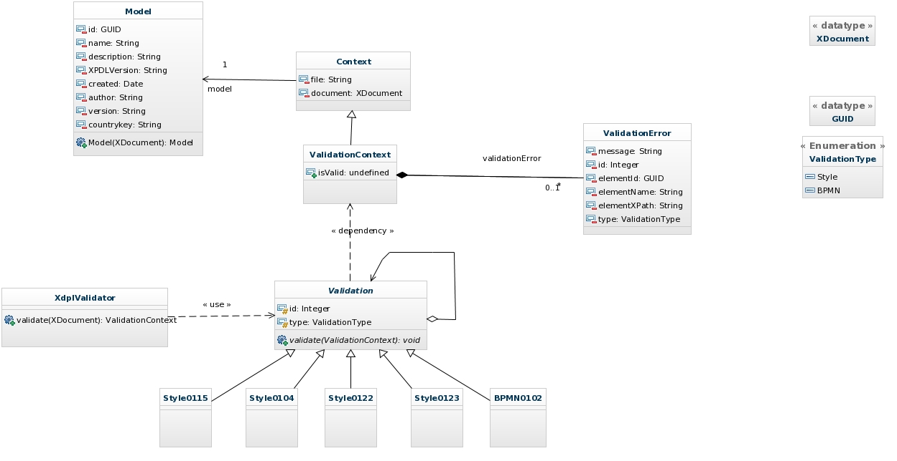

bpmn-validator
==============

BPMN Validator

View live demo at: http://bpmn-validator.azurewebsites.net/

##Tasks
- [ ] Analyse the problem
    - [X] Review xml scheme
    - [ ] Review xml errors
- [X] Static design
- [X] Select best design patter for the solution
- [X] Choose technologies
- [X] Create Visual Studio Solution
- [ ] Implement Solution
    - [X] Implement file uploader
    - [X] Process XML
    - [ ] Update class diagram
    - [ ] Detect BPMN errors
    - [X] Detect Style errors
    - [ ] Test validation outputs
    - [ ] Integrate cooler file uploader
    - [ ] Implement better styles for results
    - [ ] Implement multiple file processing
    - [ ] Test validation outputs
- [X] Deploy on Azure
    - [X] Create Web Site
    - [X] Configure continuous deployment (Continuous delivery)
- [ ] Test
    - [ ] Validate all files and posible errors

##Validations supported
- [X] Style 0104.  Two activities in the same process should not have the same name.  (Use global activity to reuse a single activity in a process.) [1][1]
- [X] Style 0115.  A throwing intermediate event should be labeled. [1][1]
- [X] Style 0122.  A catching Message event should have incoming message flow.[1][1]
- [X] Style 0123.  A throwing Message event should have outgoing message flow.[1][1]
- [X] BPMN 0102.  All flow objects other than end events and compensating activities must have an outgoing sequence flow, if the process level includes any start or end events.[1][1]

##Static Design

##Used Frameworks
- ASP.NET MVC 5
- Linq to XML
- Unity 3
- Unity.Mvc5
- Bootstrap

##Used Tools
[LiqnPad](http://www.linqpad.net/)

##Used code
- [Find duplicates with Linq][http://blogs.msdn.com/b/ericwhite/archive/2008/08/19/find-duplicates-using-linq.aspx]
- [Get the XPath to an XElement?][http://stackoverflow.com/a/454597]
- [Left Outer Join][http://msdn.microsoft.com/en-US/vstudio/ee908647.aspx#leftouterjoin]

##Continuous Delivery
Integration between Azure and GitHub

###GitHub
- master: Main development branch
- pub: deploiment branch

###Windows Azure WebSite
2 Stages configurations:
- main: production application http://bpmn-validator.azurewebsites.net/ 
- stage: test new features http://bpmn-validator-stage.azurewebsites.net/

When all new feature are tested is only swith stage and main stages

##References
- [1] [The Rules of BPMN][1]
- [2] [Process Definition Interface -- XML Process Definition Language][3]

[1]:http://brsilver.com/the-rules-of-bpmn/
[2]:http://wiki.bizagi.com/en/index.php?title=Intermediate_Event#Intermediate_Events
[3]:http://www.xpdl.org/standards/xpdl-2.1/WFMC-TC-1025-Oct-03-08-2-1.pdf